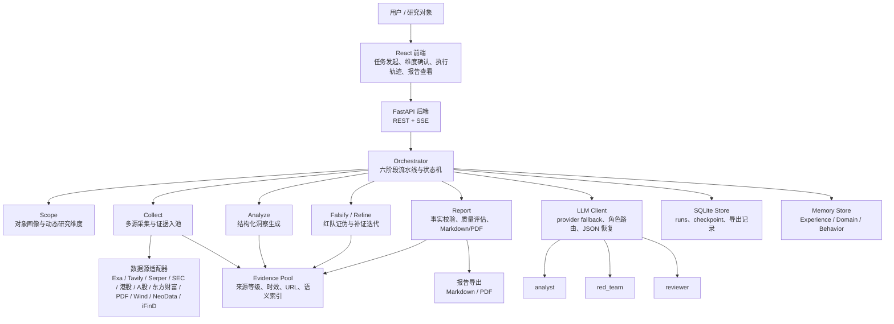
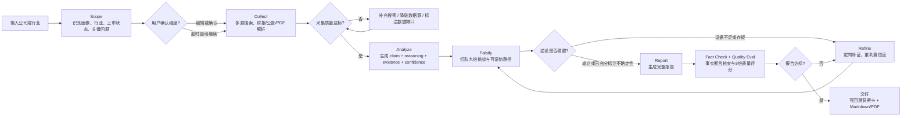

# 商业分析 Agent（Business Analyst Agent）

[](LICENSE)

> **定位**：单用户本地运行的研究型 MVP。不包含身份认证、多租户隔离、服务端任务队列和跨进程并发控制。**不建议将后端直接暴露到公网。**

一个面向公司/行业研究的自主商业分析流水线。输入研究对象后，agent 会自动完成
`界定 → 联网采集 → 结构化分析 → 红队证伪 → 迭代补证 → 产出带证据链的报告`，
并把执行轨迹、假设、反证、置信度变化全程展示出来。

> 过程即产物：整个分析链路可回溯，结论附带完整推演路径。

> **License**: This project is source-available for learning, research, and other non-commercial use under the
> [PolyForm Noncommercial License 1.0.0](LICENSE). Commercial use requires separate written permission; see
> [COMMERCIAL-LICENSE.md](COMMERCIAL-LICENSE.md).

## 它和普通 Chatbot 有什么不同

普通 chatbot 往往直接生成一篇分析稿；本项目把商业分析拆成可观测、可回放、可评估的流水线：

- **先找证据再下判断**：每条洞察都绑定证据、来源等级和数据截止日。
- **内置红队证伪**：主分析模型只负责提出结论，红队模型独立攻击结论并给出可证伪路径。
- **不靠自我感觉收敛**：置信度由证据数量、来源质量、一致性和反证状态共同裁定。
- **面向真实写作交付**：输出 Markdown / PDF 报告，支持财务表格、参考文献、事实校验和质量评估。
- **可在低配置下运行**：没有搜索或金融数据源时自动降级；没有 API Key 时进入演示模式。

## 快速导航

- [项目架构](#项目架构)
- [Workflow](#workflow)
- [快速开始](#快速开始)
- [项目结构](#项目结构)
- [授权与商用限制](#授权与商用限制)
- [可选数据源](#可选数据源按需配置)

---

## 核心设计

三条硬约束直接写进编排器代码强制执行，让分析过程始终基于外部证据：

1. 每轮迭代必须引入外部新证据。但冻结置信度需三者同时满足：无新反证 + 现有支撑不足 + 无搜索能力。现有证据充分或红队判定 solid 时不冻结，杜绝"原地反思刷自信"（reflection theater）。
2. 可证伪条件不由分析师自述（天然倾向等未来数据），而是由红队在九维挑战中基于当前已发布、已可获取材料独立输出 `falsification_path`——"什么样的现已公开可查的证据会推翻此结论"。禁止"若下季度/若明年/若后续观察"等需要等待未来数据的假设；即使红队判定 refuted，也不能用未来披露作为推翻条件。
3. 执行者不能审判自己。证伪交给异源模型（red_team 角色）扮演红队，独立攻击主分析模型的每条结论；红队每轮拿到全新无偏上下文，与上一轮修订记录隔离，防评分虚高。

收敛由量化证据强度门槛裁定（证据数量 × 溯源等级 × 一致性），模型自述"我觉得够了"不作数。编排器只负责驱动流程。

---

## 项目架构



## Workflow



---

## 研究框架的三层结构（由 agent 动态组装）

不同行业、不同公司适用不同的分析维度。框架分三层：

| 层 | 内容 | 是否变化 |
|---|---|---|
| ① 通用方法论骨架 | 溯源等级 + 可证伪原则 + 置信度评分规则 + 证伪闭环 + 对标逻辑 | 固定（分析师的"思维方式"） |
| ② 行业研究模板 | 每行业关键指标 + 特有"陷阱问题"（助贷看净息差/拨备/vintage，SaaS 看 NDR/Rule of 40） | 按行业切换，可扩展 |
| ③ 动态适配 | Scope 先判断对象画像，再决定加载哪套模板、补哪些临时问题 | agent 临场生成 |

当前内置 6 套行业模板：互联网/SaaS、金融科技/助贷、消费零售、先进制造、医疗健康、通用型。

---

## 六阶段流水线

```
Scope    界定对象画像（公司/行业、是否上市、行业、对标、关键问题），选定研究模板
         Human-in-the-loop：暂停等用户确认/编辑分析维度（300s 超时自动继续）
Collect  搜索 API + SEC EDGAR + 港股披露易 + A股财报公告 + 通用 PDF 解析
         每条证据带来源 URL 和溯源等级（1-7）
Analyze  套用行业框架，逐一审视陷阱问题，产出结构化洞察（claim+reasoning+evidence+confidence）
Falsify  异源红队对每条洞察做九维挑战，基于现有公开数据独立输出推翻路径
         重新裁决（成立/存疑/推翻/不可检验）
Refine   置信度不足者触发新一轮定向补证；stale_count 防认知打转
Report   按动态维度组织报告 + 事实校验 + 质量评估 + 迭代改进闭环
         可导出 Markdown / PDF（ReportLab 真表格 + 中文支持）
```

> 分析维度由 Scope 阶段根据对象画像动态生成：奇富科技会拆出"规模与盈利质量/资产质量真实性/资金与息差/监管合规/风控能力"，字节跳动会拆出"广告变现与增长/AI 投入与商业化/估值合理性/全球化与监管/生态位与对标"。

---

## 数据时效、多源与降级

| 特性 | 说明 |
|---|---|
| 证据时效加权 | 每条证据记录 `published_at`，按时间衰减；旧证据自动降权 |
| 历史趋势洞察 | 采集阶段额外发起历史趋势查询，报告将历史趋势并入"基本事实"段内 |
| 多源采集 | 11 个适配器：Exa 主搜索 → SEC EDGAR 美股财报 → 港股披露易 → A股财报公告 → 东方财富资讯 → 通用 PDF 解析 → Wind/NeoData/iFinD（可选） |
| 通用 PDF 解析 | 用户上传研报/招股书等任意 PDF，或 agent 搜索发现 PDF 链接自动下载解析 |
| 单 Key 降级 | 用户只配一个 LLM Key 时，红队与主分析同源；系统检测后如实标注红队独立性降级 |
| 搜索降级感知 | `search_status()` 综合判断 Exa + Tavily + Serper 可用性 |
| 前端 Key 配置 | `SettingsPanel` 支持在线配置 Key，保存即生效，无需重启 |
| 数据截止日 | 报告和洞察都带 `data_as_of` |
| 断点续跑 | checkpoint 保存每阶段成果，失败后可从断点恢复 |

---

## 输出：洞察与完整文档

逐条洞察卡片含可证伪条件、证据链、证伪记录、置信度；Report 阶段另生成一份完整分析文档（`narrative_md`），结构是：

执行摘要 → 基本事实（含历史趋势） → 核心发现 → 风险与不确定性 → 展望与关注点 → 参考文献

报告表格采用专业财务写法（YoY 行式）：每个数据指标单独一行，下方紧跟一行 YoY 同比增速。

---

## 技术栈

- 后端：Python 3.13 + FastAPI + SSE（流式推送执行轨迹）+ Pydantic + SQLite
- LLM：DeepSeek（多 provider 统一层 + 主备 fallback + 角色路由）
- 数据源：11 个可插拔适配器（Exa/SEC/港股/A股/东方财富/通用 PDF/Wind/NeoData/iFinD/Tavily/Serper）
- PDF 导出：ReportLab Platypus（真表格 + 中文支持 + YoY 副行样式）
- 前端：Vite + React + TypeScript（浅色主题，涨红跌绿），内置 API Key 配置面板
- 测试：四层（unit + contract + integration + smoke），`make test` 覆盖后端 quick tests 与前端构建

---

## 快速开始

### 环境要求

| 依赖 | 版本 | 说明 |
|------|------|------|
| Python | 3.10+ | 推荐 3.13；`start.sh` 会自动检测 |
| Node.js | 18+ | 前端构建；`start.sh` 会自动检测 |

### 1. 安装依赖

**macOS / Linux：**

```bash
python3 -m venv .venv
source .venv/bin/activate
pip install -r backend/requirements.txt

cd frontend && npm install && cd ..
```

**Windows：**

```powershell
python -m venv .venv
.venv\Scripts\activate
pip install -r backend\requirements.txt

cd frontend; npm install; cd ..
```

### 2. 配置 API Key（可选——不配也能跑演示模式）

```bash
cp .env.example .env
# 编辑 .env，按需填入：
#   DEEPSEEK_API_KEY=xxx   （主分析，推荐配置后可做真实分析）
#   EXA_API_KEY=xxx        （搜索，推荐配置）
```

> **零配置即可运行**：不填任何 Key，系统自动进入演示模式。

### 3. 一键启动

**macOS / Linux：**

```bash
./start.sh
```

**Windows：**

```powershell
# 后端
cd backend; python -m uvicorn main:app --host 127.0.0.1 --port 8000
# 前端（新终端）
cd frontend; npm run dev
```

打开 http://localhost:5173 ，输入公司或行业，点"开始分析"。

### 安全建议

- 后端推荐只监听 `127.0.0.1`（默认）
- 使用单个 Uvicorn worker（默认）
- `APP_MODE=local` 仅适用于可信本机
- 如果反向代理或部署到服务器，切换 `APP_MODE=server` 并自行补认证

### 从旧版升级

如果你之前使用过六存储（challenge_policies.json / strategy_cards.json / episodic/ 等），
需要执行一次迁移脚本：

```bash
python scripts/migrate_memory.py
```

脚本会把旧文件移动到 `memory/_old/`，可重复运行（第二次自动跳过）。建议先备份 `memory/` 目录。

---

## 项目结构

```
biz-analyst-agent/
├── backend/
│   ├── main.py                    # FastAPI 入口 + SSE 接口
│   ├── orchestrator.py            # 六阶段编排器与证伪闭环（项目核心）
│   ├── prompts.py                 # 各阶段 prompt 模板
│   ├── schemas.py                 # 洞察/证据/证伪记录/置信度 数据模型
│   ├── store.py                   # SQLite 持久化
│   ├── memory_store.py            # 三类持久化存储 + Reflection 学习环
│   ├── app_config.py              # 运行时配置与部署安全守卫
│   ├── run_metrics.py             # 运行级质量评分
│   ├── citation_validator.py      # 报告引用校验
│   ├── demo_data.py               # 演示模式脚本化数据
│   ├── llm/
│   │   ├── client.py              # LLM 统一客户端 + 主备 fallback + 角色路由
│   │   ├── model_catalog.py       # 模型能力目录 + 角色自动指派
│   │   └── providers.yaml         # Provider 配置
│   ├── tools/
│   │   ├── finance_sources.py     # 11 个数据源适配器（Exa/SEC/港股/A股/PDF...）
│   │   ├── generic_pdf.py         # 通用 PDF 文本/表格提取
│   │   ├── pdf_parser.py          # A 股年报专用解析
│   │   ├── sec_edgar.py           # SEC EDGAR 官方接口
│   │   ├── search.py              # Tavily/Serper/Exa 搜索封装
│   │   ├── fetch.py               # 网页正文抓取
│   │   ├── evidence_index.py      # 证据语义检索（嵌入 + TF-IDF 降级）
│   │   └── financial_table_extractor.py  # 财报表结构化提取
│   ├── framework/
│   │   └── analysis_framework.py  # 研究框架三层结构（通用骨架 + 行业模板）
│   ├── evals/                     # 质量评估（非日常 quick tests）
│   │   ├── fact_check.py          # 事实校验（已接入 pipeline）
│   │   ├── golden_answers.py      # Golden Answer Set 运行器
│   │   ├── golden_data.py         # Golden 基准数据（9 案例）
│   │   ├── golden_trend.py        # Golden 趋势追踪
│   │   ├── judge_client.py        # LLM-as-judge 评分客户端
│   │   ├── golden_regression.py  # 黄金案例回归（手动运行）
│   │   └── quality_benchmark.py  # 质量基准（手动运行）
│   ├── reporting/
│   │   ├── pdf_export.py          # Markdown → PDF（ReportLab 真表格 + 中文）
│   │   ├── structure.py           # 报告结构归一化
│   │   └── appendix.py            # 参考文献（APA 风格）
│   ├── tests/                     # 四层测试
│   │   ├── unit/                  # 纯函数逻辑
│   │   ├── contract/             # 接口契约
│   │   ├── integration/          # pipeline 集成
│   │   └── eval/                 # 真实 LLM 冒烟
│   └── run_all_tests.py           # 统一测试运行器
├── frontend/                      # Vite + React + TS 前端
│   └── src/
│       ├── App.tsx                # 主界面
│       ├── types.ts               # TypeScript 类型
│       └── components/            # Timeline / InsightCard / ReportView / SettingsPanel / Charts
├── goldens/                       # Golden Answers 评测基线
├── memory/                        # 持久化存储（运行时数据，git 不跟踪）
│   ├── experience.json            # 任务摘要 + 评测反馈
│   ├── domain.json                # 行业分析框架
│   ├── behavior.json              # 证伪/采集/报告策略
│   └── domain.json.example        # 通用行业框架模板
├── config/                        # 信源 tier 配置
├── start.sh                       # 一键启动
├── Makefile                       # 构建/测试命令
└── .env.example
```

---

## 自我完善

- 四层测试：unit（纯函数）+ contract（接口契约）+ integration（pipeline 集成）+ smoke（真实 LLM 冒烟）。日常 quick tests 保持离线、快速、确定性。
- Golden Answer Set：用真实可溯源的基准答案（9 案例，覆盖海内外/上市非上市/公司行业）验证真实 LLM 输出。离线自检零成本。
- 三类持久化存储 + Reflection 学习环：Experience（任务摘要，跨任务复盘输入）+ Domain（行业框架，决定看什么）+ Behavior（行为策略，决定怎么做）。Reflection 蒸馏 Experience 中的失败模式，直接写入 Domain/Behavior。
- Strategy Card Evolution：任务结束后把采集/证伪/报告缺陷归因为可执行策略卡（存入 Behavior），下次同类任务自动应用。
- 事实校验闭环：pipeline 内部 fact_check 提取断言并对照证据池验证，结果驱动报告迭代改进。eval_feedback 跨 run 传递泛化自知。
- 评测驱动迭代：Report 阶段 quality_eval 循环（8 维度评分 + fact_check），不达标触发补证搜索 + 重写报告段落。
- Token 成本面板：按阶段、角色和模型汇总调用次数、输入/输出 token 与估算成本，便于定位高成本环节。

---

## 局限性

- **不构成投资建议**：本项目是分析工具，所有输出应由专业人士复核。
- **单用户本地产品**：不包含身份认证、多租户隔离和服务端任务队列。不要将后端直接暴露到公网。
- 非上市公司公开数据稀疏，结论以定性为主，报告会明确标注数据可信度。
- 涨跌颜色遵循中国习惯（涨红跌绿）。
- 线程安全保证仅限单进程；多 worker 部署前需迁移到 SQLite 存储。

---

## 授权与商用限制

本项目采用 [PolyForm Noncommercial License 1.0.0](LICENSE)。你可以在非商用场景下查看、学习、研究、修改和分发本项目。

商业用途需要单独获得书面授权，包括但不限于：

- 集成到商业产品、SaaS 服务、内部生产系统或付费咨询交付中。
- 为公司、客户或其他商业组织提供业务分析、投研、自动化报告等服务。
- 将本项目或其修改版本作为收费产品、托管服务、插件、模板或数据处理流水线的一部分。

如需商业授权，请通过 GitHub 联系仓库 owner。更多说明见 [COMMERCIAL-LICENSE.md](COMMERCIAL-LICENSE.md)。

---

## 工程化验证与部署安全

### 推荐验证路径

```bash
make install
make test
make dev
```

CI 已覆盖后端编译、后端 quick tests 和前端构建。

### local / server 模式

通过 `.env` 中的 `APP_MODE` 区分运行边界：

```text
APP_MODE=local   # 本机 demo / 单人使用
APP_MODE=server  # 团队或服务器部署
```

`server` 模式默认关闭前端运行时写入 API Key、自定义 provider 持久化、`.env` 追加写入。

### 运行指标导出

每次流程正常结束时会生成运行级指标：

- `collect_quality`：采集阶段证据质量评分
- `quality_eval`：报告阶段 8 维度质量评分
- `token_summary`：模型调用次数、输入/输出 token、估算成本，以及按阶段/角色/模型拆分的成本结构
- `diagnostics`：降级、异常摘要

---

## 可选数据源（按需配置）

以下数据源为可选项，未配置时系统自动降级，不影响核心功能。

| 数据源 | 说明 | 配置方式 |
|--------|------|----------|
| **Exa 语义搜索** | 主搜索源，免费 | `npm i -g mcporter && mcporter config add exa https://mcp.exa.ai/mcp --header "Authorization=Bearer <KEY>"` |
| **Wind MCP / AIFin Market** | 金融结构化数据 | 配置 `WIND_MCP_SERVER` + `WIND_MCP_TOOL` 走 mcporter |
| **Tavily** | 结构化搜索补充 | `.env` 填 `TAVILY_API_KEY` |
| **Serper** | 搜索备用 | `.env` 填 `SERPER_API_KEY` |
| **SEC EDGAR** | 美股官方财报，免费 | `.env` 填 `SEC_USER_AGENT` |
| iFinD | 同花顺金融数据 | 安装对应扩展脚本，后端自动识别 |
| NeoData | 金融数据 API | 安装对应扩展脚本，后端自动识别 |

> 通用 PDF 解析、港股披露易、A股财报公告、东方财富资讯均为内置数据源，无需配置。
